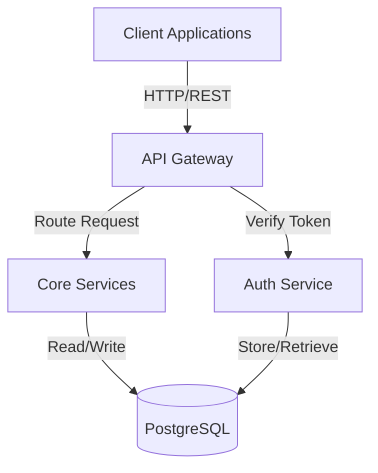

# Document Agent Specification

**Agent Type:** QUAD Server Agent (Service-Account)
**Version:** 1.0
**Status:** Planned for Phase 2 (Q2 2026)
**Last Updated:** January 8, 2026

---

## Overview

The **Document Agent** automatically generates, updates, and maintains documentation across an organization's codebases. It transforms code, comments, and specifications into comprehensive, up-to-date technical documentation that keeps pace with development.

### Core Capabilities

1. **Auto-Generate API Documentation** - From code comments and endpoints
2. **Update README Files** - Reflect latest features and usage
3. **Maintain Changelog** - Track feature releases and breaking changes
4. **Generate Architecture Docs** - From code structure and design comments
5. **Keep Docs in Sync** - When code changes trigger documentation updates

---

## Agent Triggers

### Automatic Triggers

| Trigger | Condition | Action |
|---------|-----------|--------|
| **PR Merge** | Code merged to main branch | Scan for new/changed endpoints, update docs |
| **Code Comment Change** | JSDoc, JavaDoc updated | Regenerate API docs |
| **Version Tag** | Git tag created (v1.2.3) | Auto-generate changelog entry |
| **Schema Change** | Database/API schema updated | Update data model documentation |

### Manual Triggers

```
📧 Email: "document my API"
💬 Messenger: "@quad document /api/users endpoint"
🖥️ QUAD App: Dashboard > "Generate Docs" button
```

---

## Capabilities & Modes

### 1. API Documentation Generation

**Input:** Code with JSDoc/JavaDoc comments
**Output:** OpenAPI 3.0 spec, interactive API docs

**Supported Formats:**
- ✅ TypeScript/JavaScript (JSDoc)
- ✅ Java (JavaDoc)
- ✅ Python (Docstrings)
- ✅ Go (Godoc comments)
- ✅ Rust (Doc comments)

**Example Input (TypeScript):**
```typescript
/**
 * Create a new ticket in the system
 * @param title - Ticket title (max 200 chars)
 * @param description - Detailed description
 * @returns {Promise<Ticket>} Created ticket with ID
 * @throws {ValidationError} If title is empty or >200 chars
 * @example
 * const ticket = await createTicket('Bug fix', 'Login page issue');
 */
async function createTicket(title: string, description: string): Promise<Ticket> {
  if (!title || title.length > 200) throw new ValidationError();
  return await ticketService.create({ title, description });
}
```

**Example Output (Markdown):**
```markdown
# API: Create Ticket

## Endpoint
`POST /api/tickets`

## Description
Create a new ticket in the system

## Parameters
- `title` (string, required) - Ticket title, max 200 characters
- `description` (string) - Detailed description

## Response
```json
{
  "id": "uuid",
  "title": "Bug fix",
  "description": "Login page issue",
  "createdAt": "2026-01-08T10:30:00Z"
}
```

## Errors
- `ValidationError` - If title is empty or exceeds 200 characters

## Example
```bash
curl -X POST https://api.example.com/api/tickets \
  -H "Content-Type: application/json" \
  -d '{"title": "Bug fix", "description": "Login page issue"}'
```
```

---

### 2. README File Updates

**Detects:** New features, breaking changes, setup instructions
**Updates:** README.md with latest information

**Sections Updated:**
- ✅ Features list
- ✅ Installation & setup
- ✅ Quick start examples
- ✅ Configuration options
- ✅ Breaking changes
- ✅ Contributing guidelines

**Change Detection:**
```
Code Change → Document Agent → Analyze impact → Update README
"Added user authentication" → "## Authentication" section updated
"Removed deprecated API" → "Breaking Changes" section added
"Changed env variable" → "Configuration" section updated
```

**Example (Before):**
```markdown
# My Project

Quick utility for managing tasks.

## Installation
npm install
```

**Example (After):**
```markdown
# My Project

Quick utility for managing tasks with real-time updates.

## Installation
npm install myproject

## Quick Start
```bash
npx myproject init
myproject create "Buy milk"
myproject list
```

## Features
- ✅ Create tasks (new in v1.2)
- ✅ Real-time updates (new in v1.2)
- ✅ Mark complete
- ✅ Delete tasks

## Breaking Changes
- **v1.2**: `myproject open` renamed to `myproject list`
```

---

### 3. Architecture Documentation

**Detects:** System design from code structure
**Generates:** Architecture diagrams, component relationships

**Outputs:**
- ✅ System architecture diagram (ASCII art or Mermaid)
- ✅ Component overview
- ✅ Data flow diagrams
- ✅ Integration points with external services

**Example Output:**
```markdown
# System Architecture

## Overview


## Components

### API Gateway
- Location: `quad-api/src/`
- Responsibility: Rate limiting, authentication, routing
- Dependencies: Node.js Express

### Auth Service
- Location: `quad-services/src/service/AuthService.java`
- Responsibility: JWT generation, user verification
- Dependencies: Spring Security, PostgreSQL

### Core Services
- Ticket service, Workflow service, Reporting service
- All located in `quad-services/src/service/`
```

---

### 4. Changelog Generation

**Detects:** Version tags, commits, PRs
**Generates:** CHANGELOG.md entries

**Format:** Keep a Changelog standard (https://keepachangelog.com/)

**Example Output:**
```markdown
# Changelog

## [1.2.0] - 2026-01-08

### Added
- New authentication system with OAuth 2.0 support
- Real-time task updates via WebSocket
- Dark mode toggle in settings

### Changed
- Renamed `open` command to `list`
- Updated database schema (migration required)

### Fixed
- Bug where completed tasks weren't saved (PR #234)
- Performance issue with large task lists

### Deprecated
- `myproject open` command (use `list` instead)

### Removed
- Deprecated `/api/v1/tasks` endpoint

### Security
- Fixed XSS vulnerability in task description field

## [1.1.0] - 2025-12-15
...
```

---

## Workflow & Process

### How Document Agent Works

```
1. Trigger (PR merge, version tag, manual request)
        ↓
2. Scan codebase for changes
   - New files
   - Modified comments/docs
   - Schema changes
        ↓
3. Extract documentation from code
   - JSDoc/JavaDoc comments
   - Function signatures
   - Type definitions
        ↓
4. Generate markdown
   - API docs
   - README updates
   - Changelog entries
        ↓
5. Create PR with updates
   - File: GENERATED.md or API.md
   - Title: "docs: Auto-generated documentation"
   - Body: "Changes detected since last version"
        ↓
6. Team reviews and approves
   - Can edit if needed
   - Can reject if inaccurate
        ↓
7. Merge documentation
   - Docs committed to repo
   - Version tagged if relevant
```

---

## Configuration & Customization

### Agent Settings

```yaml
# .quad/document-agent.yml
enabled: true

api_docs:
  enabled: true
  format: "openapi-3.0"  # or "html", "markdown"
  output_file: "docs/api.md"
  exclude_internal: true  # Skip @internal marked APIs

readme:
  enabled: true
  update_features: true
  update_setup: true
  update_changelog: true

architecture:
  enabled: true
  format: "mermaid"  # or "ascii"
  output_file: "docs/architecture.md"

changelog:
  enabled: true
  output_file: "CHANGELOG.md"
  format: "keep-a-changelog"
  group_by: "type"  # "type" or "component"

ignore:
  - "docs/**"  # Don't document documentation files
  - "test/**"  # Exclude test files
  - ".git/**"  # Exclude git internals
```

### Custom Comment Markers

```typescript
/**
 * @quad-doc-skip  // Don't generate docs for this
 * Internal utility
 */
function internalHelper() { ... }

/**
 * @quad-doc-example
 * const result = myFunction("input");
 * console.log(result); // Output: processed
 */
```

---

## Integration Points

### GitHub Integration
- ✅ Reads push events (on merge to main)
- ✅ Analyzes changed files
- ✅ Creates PR with documentation updates
- ✅ Posts comment with summary
- ✅ Links to generated docs

### Jira Integration (Future)
- Creates issue when docs are out of sync
- Links to documentation PRs
- Tracks documentation completeness

### Slack/Messenger Integration
- ✅ "@quad document my API" → Creates PR
- ✅ Notifies team when docs updated
- ✅ Links to generated documentation

---

## Example: Document Agent in Action

### Scenario: New API Endpoint Added

**Step 1: Developer creates PR**
```typescript
// src/services/UserService.ts
/**
 * Get user by ID
 * @param userId - UUID of the user
 * @returns {Promise<User>} User object
 * @throws {NotFoundError} If user doesn't exist
 */
async getUserById(userId: string): Promise<User> {
  return await userRepository.findById(userId);
}
```

**Step 2: PR merged to main**
- GitHub webhook fires
- Document Agent analyzes changes
- Detects new function with JSDoc

**Step 3: Agent generates documentation PR**
- Creates `docs/api.md` with new endpoint
- Updates `README.md` features list
- Posts message: "📚 Generated documentation for 1 new endpoint"

**Step 4: Team reviews**
```markdown
# PR: docs: Auto-generated documentation

## Changes
- ✅ Added GET /api/users/{userId} to API docs
- ✅ Updated features list in README.md

## Generated Docs
### Get User by ID
Endpoint: GET /api/users/{userId}
Description: Get user by ID
...
```

**Step 5: Merge**
- Docs committed alongside code
- Always in sync

---

## Error Handling & Edge Cases

### Scenarios Handled

| Scenario | Action |
|----------|--------|
| Comment has no JSDoc | Skip that function |
| Code is outdated vs docs | Ask human to review |
| Large document would exceed limits | Split into sections |
| Schema inconsistency detected | Warn and ask for clarification |
| Merge conflict in docs | Create separate PR for manual resolution |

---

## Limitations & Scope

### What Document Agent Does NOT Do

- ❌ Write tutorial content (too subjective)
- ❌ Generate test documentation (Test Agent does this)
- ❌ Replace human-written guides (only auto-generates API/arch docs)
- ❌ Translate documentation (future feature)
- ❌ Generate user manuals (beyond API scope)

### Supported Repositories

- ✅ GitHub
- ✅ GitLab
- ✅ Bitbucket
- ❌ Azure DevOps (future)

---

## Success Metrics

| Metric | Target | How Measured |
|--------|--------|--------------|
| Docs up-to-date | 100% | Diff check between code and docs |
| PR merge time | <5 min | Time from PR creation to merge |
| Documentation coverage | 95%+ | % of public APIs with docs |
| Team satisfaction | 4.5/5 | Quarterly survey |
| Time saved per dev | 2 hrs/week | Documentation generation time |

---

## Roadmap

**Phase 1 (Q2 2026):** MVP
- ✅ API documentation generation
- ✅ README updates
- ✅ GitHub integration

**Phase 2 (Q3 2026):** Advanced
- Architecture diagrams
- Changelog generation
- GitLab/Bitbucket support

**Phase 3 (Q4 2026):** Enhancements
- Jira integration
- Tutorial generation
- Multi-language support

---

**Next Steps:**
- [ ] Design database schema for doc metadata
- [ ] Implement JSDoc parser
- [ ] Build GitHub PR creation logic
- [ ] Create test suite
- [ ] Write user guide for configuration

---

**Maintained By:** QUAD Platform Team
**Contact:** Document Agent Maintainer
