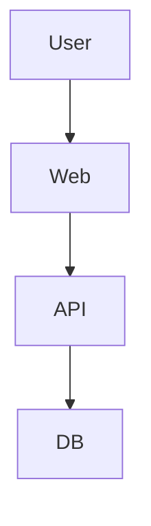

# QUAD Documentation Standards

**Version:** 1.0
**Created:** January 14, 2026

---

## Overview

Every QUAD project MUST have standardized documentation structure.
- Each doc type = **FOLDER** with `README.md` inside
- `quad init` creates this structure automatically
- `quad doc` updates documentation from code

---

## Project Structure

```
my-project/                          # Initiative umbrella
├── README.md                        # Project overview (mandatory)
├── CLAUDE.md                        # AI context (mandatory)
├── .quad/
│   └── config.json                  # QUAD config (auto-generated)
│
├── documentation/                   # Documentation root
│   ├── architecture/
│   │   └── README.md                # System design, diagrams
│   ├── database/
│   │   └── README.md                # Schema, ERD, migrations
│   ├── api/
│   │   └── README.md                # Endpoints, request/response
│   ├── web/
│   │   └── README.md                # Frontend components, routes
│   ├── mobile/
│   │   └── README.md                # iOS/Android specifics
│   ├── deployment/
│   │   └── README.md                # Deploy steps, environments
│   ├── security/
│   │   └── README.md                # Auth, secrets, compliance
│   ├── testing/
│   │   └── README.md                # Test strategy, coverage
│   └── misc/
│       └── README.md                # Uncategorized (reorganize later)
│
├── my-project-database/             # Submodule - DB team
├── my-project-api/                  # Submodule - Backend team
├── my-project-web/                  # Submodule - Frontend team
├── my-project-android/              # Submodule - Android team
├── my-project-ios/                  # Submodule - iOS team
└── shared-components/               # Shared across projects
```

---

## Standard Documentation Folders

| Folder | Purpose | Owner | Auto-Gen |
|--------|---------|-------|----------|
| `documentation/architecture/` | System design, diagrams, decisions | Architect | Partial |
| `documentation/database/` | Schema, ERD, migrations, seeds | DB Engineer | Yes |
| `documentation/api/` | Endpoints, request/response, errors | Backend Dev | Yes |
| `documentation/web/` | Components, routes, state mgmt | Frontend Dev | Partial |
| `documentation/mobile/` | iOS/Android screens, builds | Mobile Dev | Partial |
| `documentation/deployment/` | Environments, CI/CD, rollback | DevOps | Partial |
| `documentation/security/` | Auth, secrets, compliance | Security | Manual |
| `documentation/testing/` | Strategy, coverage, fixtures | QA | Partial |
| `documentation/misc/` | Uncategorized items | Anyone | Manual |

---

## quad init Flow

When user runs `quad init`:

```
Step 1: Ask project details
        → Project name, org, type

Step 2: Create project folder
        → my-project/

Step 3: Create .quad/ config
        → my-project/.quad/config.json

Step 4: Create mandatory files
        → my-project/README.md
        → my-project/CLAUDE.md

Step 5: Create documentation structure
        → my-project/documentation/architecture/README.md
        → my-project/documentation/database/README.md
        → my-project/documentation/api/README.md
        → my-project/documentation/web/README.md
        → my-project/documentation/mobile/README.md
        → my-project/documentation/deployment/README.md
        → my-project/documentation/security/README.md
        → my-project/documentation/testing/README.md
        → my-project/documentation/misc/README.md

Step 6: Save to database
        → quad_organizations
        → quad_domains
        → quad_flows
```

---

## Template: docs/architecture/README.md

```markdown
# {Project Name} - Architecture

## Overview
Brief description of the system.

## System Diagram


## Components
| Component | Technology | Purpose |
|-----------|------------|---------|
| API | Spring Boot | Backend services |
| Web | Next.js | Frontend |
| DB | PostgreSQL | Data storage |

## Data Flow
1. User → Web → API → DB
2. ...

## Key Decisions
| Decision | Rationale | Date |
|----------|-----------|------|
| Use PostgreSQL | ACID compliance | 2026-01-01 |

## Related Docs
- [Database](../database/README.md)
- [API](../api/README.md)
```

---

## Template: docs/database/README.md

```markdown
# {Project Name} - Database

## Overview
- **Database:** PostgreSQL
- **Schema:** public
- **Tables:** {count}

## ERD
[Auto-generated ERD diagram]

## Tables

### users
| Column | Type | Nullable | Description |
|--------|------|----------|-------------|
| id | UUID | NO | Primary key |
| email | VARCHAR | NO | User email |
| created_at | TIMESTAMP | NO | Creation time |

### (other tables...)

## Migrations
| Version | Description | Date |
|---------|-------------|------|
| V1 | Initial schema | 2026-01-01 |

## Seeds
| File | Purpose |
|------|---------|
| `demo-data.sql` | Demo data |
| `test-data.sql` | Test fixtures |
```

---

## Template: docs/api/README.md

```markdown
# {Project Name} - API

## Base URL
| Env | URL |
|-----|-----|
| Dev | `http://localhost:8080/api` |
| Prod | `https://api.example.com/api` |

## Authentication
```
Authorization: Bearer {token}
```

## Endpoints

### Auth
| Method | Endpoint | Description |
|--------|----------|-------------|
| POST | `/auth/login` | Login |
| POST | `/auth/register` | Register |

### Users
| Method | Endpoint | Description |
|--------|----------|-------------|
| GET | `/users` | List users |
| GET | `/users/:id` | Get user |

## Examples

### POST /auth/login
**Request:**
```json
{ "email": "user@example.com", "password": "secret" }
```

**Response:**
```json
{ "success": true, "data": { "token": "eyJ..." } }
```

## Errors
| Code | Message |
|------|---------|
| 400 | Bad Request |
| 401 | Unauthorized |
| 404 | Not Found |
```

---

## Template: docs/web/README.md

```markdown
# {Project Name} - Web

## Technology
- **Framework:** Next.js 14
- **UI:** Tailwind CSS
- **State:** Zustand

## Routes
| Route | Component | Auth |
|-------|-----------|------|
| `/` | HomePage | No |
| `/login` | LoginPage | No |
| `/dashboard` | DashboardPage | Yes |

## Components

### UI Components (`components/ui/`)
| Component | Purpose |
|-----------|---------|
| Button | Reusable button |
| Card | Card container |

### Feature Components (`components/features/`)
| Component | Purpose |
|-----------|---------|
| UserProfile | User profile view |

## Environment
| Variable | Description |
|----------|-------------|
| NEXT_PUBLIC_API_URL | API base URL |

## Commands
```bash
npm run dev      # Development
npm run build    # Production build
npm run start    # Start production
```
```

---

## Template: docs/mobile/README.md

```markdown
# {Project Name} - Mobile

## Platforms
| Platform | Language | Min Version |
|----------|----------|-------------|
| iOS | Swift/SwiftUI | iOS 15 |
| Android | Kotlin/Compose | API 26 |

## Architecture
MVVM with Clean Architecture

## Screens
| Screen | iOS | Android | Description |
|--------|-----|---------|-------------|
| Login | ✓ | ✓ | Authentication |
| Home | ✓ | ✓ | Dashboard |

## Build

### iOS
```bash
cd ios && pod install && open App.xcworkspace
```

### Android
```bash
cd android && ./gradlew assembleDebug
```
```

---

## Template: docs/deployment/README.md

```markdown
# {Project Name} - Deployment

## Environments
| Env | URL | Branch |
|-----|-----|--------|
| Dev | localhost | feature/* |
| QA | qa.example.com | develop |
| Prod | example.com | main |

## Prerequisites
- Docker
- kubectl
- GCP credentials

## Deploy
```bash
# Dev
docker-compose up -d

# QA/Prod
./scripts/deploy.sh qa
./scripts/deploy.sh prod
```

## Rollback
```bash
./scripts/rollback.sh prod v1.2.3
```

## Monitoring
- **Logs:** Cloud Logging
- **Metrics:** Grafana
- **Alerts:** PagerDuty
```

---

## Template: docs/security/README.md

```markdown
# {Project Name} - Security

## Authentication
- **Method:** JWT
- **Expiry:** 24 hours
- **Refresh:** 7 days

## Authorization
| Role | Permissions |
|------|-------------|
| Admin | Full access |
| User | Read own data |

## Secrets
- **Storage:** GCP Secret Manager
- **Rotation:** Every 90 days

## Checklist
- [ ] Input validation
- [ ] SQL injection prevention
- [ ] XSS prevention
- [ ] CSRF tokens
- [ ] Rate limiting
```

---

## Template: docs/testing/README.md

```markdown
# {Project Name} - Testing

## Strategy
| Type | Tool | Target |
|------|------|--------|
| Unit | JUnit/Jest | 80% |
| Integration | TestContainers | Key flows |
| E2E | Cypress | Happy paths |

## Commands
```bash
npm test              # Unit
npm run test:int      # Integration
npm run test:e2e      # E2E
```

## Test Data
- **Location:** `tests/fixtures/`
- **Reset:** `npm run test:reset`
```

---

## Template: docs/misc/README.md

```markdown
# {Project Name} - Miscellaneous

Items that don't fit elsewhere. Review periodically and reorganize.

## Items

### 2026-01-14 - {Topic}
Description...

---

## TODO: Reorganize
- [ ] Move X to architecture/
- [ ] Move Y to api/
```

---

## Commands

```bash
# Initialize project with full doc structure
quad init

# Generate/update specific docs from code
quad doc generate database    # From SQL files
quad doc generate api         # From OpenAPI/code
quad doc generate web         # From components

# Validate documentation structure
quad doc validate

# Show doc coverage
quad doc status
```

---

## Naming Conventions

| Type | Pattern | Example |
|------|---------|---------|
| Umbrella | `{name}` | `nutrinine` |
| Database | `{name}-database` | `nutrinine-database` |
| API | `{name}-api` | `nutrinine-api` |
| Web | `{name}-web` | `nutrinine-web` |
| Android | `{name}-android` | `nutrinine-android` |
| iOS | `{name}-ios` | `nutrinine-ios` |
| Shared | `shared-{type}` | `shared-ui` |

---

**Copyright © 2026 Gopi Suman Addanke. All Rights Reserved.**
